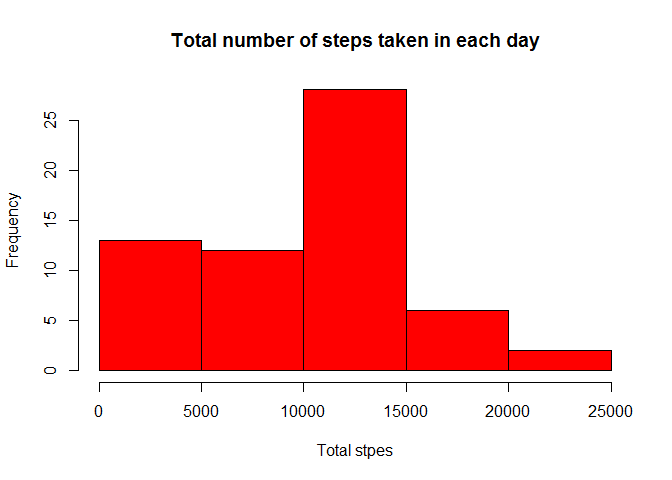
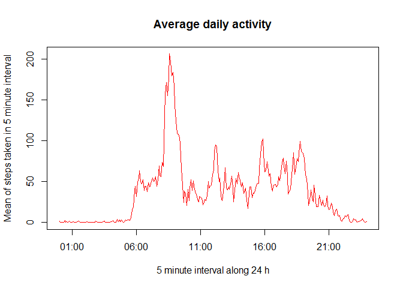
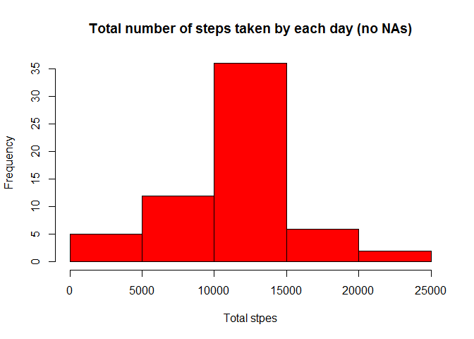
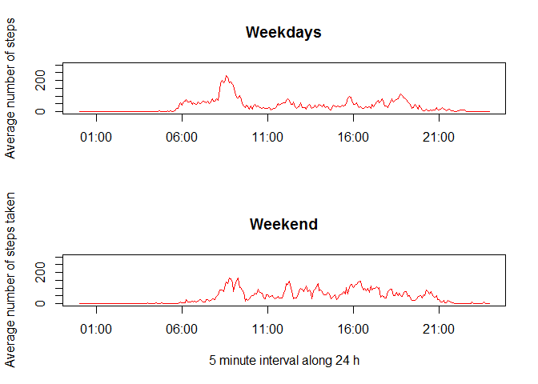

# Reproducible Research: Peer Assessment 1


## Loading and preprocessing the data
Using the function read.csv and the function unz


```r
data<-read.csv(unz("activity.zip","activity.csv"))
head(data)
```

```
##   steps       date interval
## 1    NA 2012-10-01        0
## 2    NA 2012-10-01        5
## 3    NA 2012-10-01       10
## 4    NA 2012-10-01       15
## 5    NA 2012-10-01       20
## 6    NA 2012-10-01       25
```

Creating two variables to processing date and time informations

```r
date<-data$date
time<-data$interval
```

Now, we will adjust the variable time in order to be possible the convertion in class POSIXlt


```r
time.adjusted<-sprintf("%04d", time)
head(time.adjusted)
```

```
## [1] "0000" "0005" "0010" "0015" "0020" "0025"
```

Finally, the variable dateandtime is created. This variable will be used in all plots of time series

```r
dateandtime<-paste(date, time.adjusted)
dateandtime<-strptime(dateandtime, "%Y-%m-%d %H%M")
class(dateandtime)
```

```
## [1] "POSIXlt" "POSIXt"
```

```r
head(dateandtime)
```

```
## [1] "2012-10-01 00:00:00 BRT" "2012-10-01 00:05:00 BRT"
## [3] "2012-10-01 00:10:00 BRT" "2012-10-01 00:15:00 BRT"
## [5] "2012-10-01 00:20:00 BRT" "2012-10-01 00:25:00 BRT"
```

## What is mean total number of steps taken per day?

Firstly, we will calculate the total number of steps taken by day using the function tapply

```r
stepspday<-tapply(data$steps,data$date,sum,na.rm=TRUE)
head(stepspday)
```

```
## 2012-10-01 2012-10-02 2012-10-03 2012-10-04 2012-10-05 2012-10-06 
##          0        126      11352      12116      13294      15420
```

Now, we will create a histogram of the total steps taken each day.

```r
hist(stepspday,col="red", main="Total number of steps taken in each day",xlab="Total stpes")
```

<!-- -->

Finally, we will  calculate the mean and median of total steps taken each day.

```r
options(scipen = 1, digits = 2)
stepspday.mean<-mean(stepspday[stepspday!=0])
stepspday.median<-median(stepspday[stepspday!=0])
```
So, the mean of steps taken each day is **10766.19** and the median of steps taken each day is **10765**.

## What is the average daily activity pattern?

Firstly, we will calculate the mean of steps taken in each 5 minute interval. Again, we will use the function taplly.

```r
stepspinterval<-tapply(data$steps,data$interval,mean,na.rm=TRUE)
head(stepspinterval)
```

```
##     0     5    10    15    20    25 
## 1.717 0.340 0.132 0.151 0.075 2.094
```

Now, we will plot the variable created above in function of each 5 minute interval.

```r
## The x axis variable dateandtime[1:288] was setted only for purpose of visualisation. The subset 1:288 is exactly one day of measured data.

plot(dateandtime[1:288],stepspinterval, type="l",ylab="Mean of steps taken in 5 minute interval", xlab="5 minute interval along 24 h", col="red", main="Average daily activity")
```

<!-- -->

Finally, we will determine which 5 minute interval contains the biggest average of steps. 

For this, we will subset the vector of one day 5 minute interval for the maximum mean verified in stepspinterval funciotn.

```r
max.average<-dateandtime[1:288][stepspinterval==max(stepspinterval)]
```

So, the interval with biggest average steps is the 5 minute interval beggining in **8h:35min**.

## Imputing missing values

This section begins with calculation of how many NAs is present in data provided.

```r
NA.total<-sum(is.na(data$steps))
```
The number os NAs in data provided is **2304**.

Now, we will change the NA present in data for values. These values will be the mean verified for the same 5 minute interval.

Firstly, we will create another element in data. It will be the average steps for each interval, that was calculate in section above.

```r
average<-c(rep(stepspinterval,61))
data$average<-average
head(data)
```

```
##   steps       date interval average
## 1    NA 2012-10-01        0   1.717
## 2    NA 2012-10-01        5   0.340
## 3    NA 2012-10-01       10   0.132
## 4    NA 2012-10-01       15   0.151
## 5    NA 2012-10-01       20   0.075
## 6    NA 2012-10-01       25   2.094
```

Now, we will create another elemente in data. It will be steps without missing data. This element will be steps element if is not a missing number, otherwise it will be average element value.

```r
newsteps<-NULL
for (i in 1:length(data[,1])){
  if (is.na(data[i,]$steps)){
    newsteps[i]<-data[i,]$average
  } else {
    newsteps[i]<-data[i,]$steps
  }
}
data$newsteps<-newsteps
head(data)
```

```
##   steps       date interval average newsteps
## 1    NA 2012-10-01        0   1.717    1.717
## 2    NA 2012-10-01        5   0.340    0.340
## 3    NA 2012-10-01       10   0.132    0.132
## 4    NA 2012-10-01       15   0.151    0.151
## 5    NA 2012-10-01       20   0.075    0.075
## 6    NA 2012-10-01       25   2.094    2.094
```

Firstly, we will calculate the total number of steps (with no NAs) taken by day using the function tapply

```r
stepspday.no.NA<-tapply(data$newsteps,data$date,sum)
head(stepspday.no.NA)
```

```
## 2012-10-01 2012-10-02 2012-10-03 2012-10-04 2012-10-05 2012-10-06 
##      10766        126      11352      12116      13294      15420
```

Now, we will create a histogram of the variable newsteps.

```r
hist(stepspday.no.NA,col="red", main="Total number of steps taken by each day (no NAs)",xlab="Total stpes")
```

<!-- -->

Finally, we will  calculate the mean and median of total steps taken each day.

```r
options(scipen = 1, digits = 2)
stepspday.no.NA.mean<-mean(stepspday.no.NA)
stepspday.no.NA.median<-median(stepspday.no.NA)
```
So, the mean of steps taken each day is **10766.19** and the median of steps taken each day is **10766.19**.

Only median has changed after treatment of missing values!!

## Are there differences in activity patterns between weekdays and weekends?

Firstly, we will create another element that will represent the of the week for each data collected.

```r
weekday<-NULL
for (i in 1:length(data[,1])){
  if (dateandtime[i]$wday>0 && dateandtime[i]$wday<6){
    weekday[i]<-"Weekday"
  } else {
    weekday[i]<-"Weekend"
  }
}
data$weekday<-weekday
head(data)
```

```
##   steps       date interval average newsteps weekday
## 1    NA 2012-10-01        0   1.717    1.717 Weekday
## 2    NA 2012-10-01        5   0.340    0.340 Weekday
## 3    NA 2012-10-01       10   0.132    0.132 Weekday
## 4    NA 2012-10-01       15   0.151    0.151 Weekday
## 5    NA 2012-10-01       20   0.075    0.075 Weekday
## 6    NA 2012-10-01       25   2.094    2.094 Weekday
```

Now, we will split de data accordind to day of the week. The function used is split.

```r
data.splited<-split(data,data$weekday)
str(data.splited)
```

```
## List of 2
##  $ Weekday:'data.frame':	12960 obs. of  6 variables:
##   ..$ steps   : int [1:12960] NA NA NA NA NA NA NA NA NA NA ...
##   ..$ date    : Factor w/ 61 levels "2012-10-01","2012-10-02",..: 1 1 1 1 1 1 1 1 1 1 ...
##   ..$ interval: int [1:12960] 0 5 10 15 20 25 30 35 40 45 ...
##   ..$ average : num [1:12960] 1.717 0.3396 0.1321 0.1509 0.0755 ...
##   ..$ newsteps: num [1:12960] 1.717 0.3396 0.1321 0.1509 0.0755 ...
##   ..$ weekday : chr [1:12960] "Weekday" "Weekday" "Weekday" "Weekday" ...
##  $ Weekend:'data.frame':	4608 obs. of  6 variables:
##   ..$ steps   : int [1:4608] 0 0 0 0 0 0 0 0 0 0 ...
##   ..$ date    : Factor w/ 61 levels "2012-10-01","2012-10-02",..: 6 6 6 6 6 6 6 6 6 6 ...
##   ..$ interval: int [1:4608] 0 5 10 15 20 25 30 35 40 45 ...
##   ..$ average : num [1:4608] 1.717 0.3396 0.1321 0.1509 0.0755 ...
##   ..$ newsteps: num [1:4608] 0 0 0 0 0 0 0 0 0 0 ...
##   ..$ weekday : chr [1:4608] "Weekend" "Weekend" "Weekend" "Weekend" ...
```

Firstly, we will calculate the mean of steps taken in each 5 minute interval. Again, we will use the function taplly.

```r
stepspinterval.weekday<-tapply(data.splited$Weekday$newsteps,data.splited$Weekday$interval,mean)

stepspinterval.weekend<-tapply(data.splited$Weekend$newsteps,data.splited$Weekend$interval,mean)
head(stepspinterval.weekday)
```

```
##     0     5    10    15    20    25 
## 2.251 0.445 0.173 0.198 0.099 1.590
```

```r
head(stepspinterval.weekend)
```

```
##      0      5     10     15     20     25 
## 0.2146 0.0425 0.0165 0.0189 0.0094 3.5118
```

Finally, it will be created the plot with average steps in each 5 minute interval for weekdays and weekends.

```r
par(mfrow=c(2,1))

## The x axis variable dateandtime[1:288] was setted only for purpose of visualisation. The subset 1:288 is exactly one day of measured data.

plot(dateandtime[1:288],stepspinterval.weekday, type="l", col="red",main="Weekdays", ylim=c(0,300),xlab="",ylab="Average number of steps")

plot(dateandtime[1:288],stepspinterval.weekend, type="l",xlab="5 minute interval along 24 h", col="red", main="Weekend",ylim=c(0,300),ylab="Average number of steps taken")
```

<!-- -->

